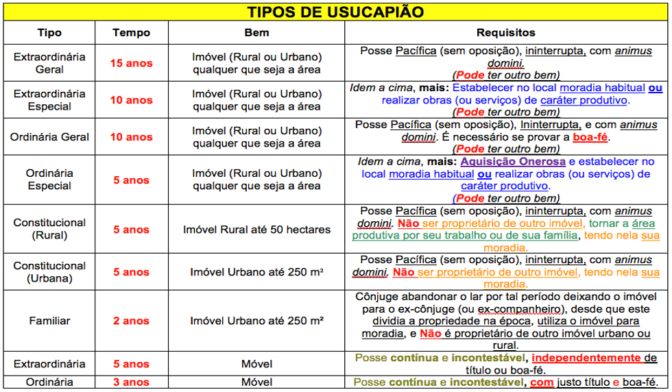

# Aquisição de Propriedade

## Adquire-se a propriedade de forma originária e derivada.

### Originária

Quando desvinculada de qualquer relação com titular anterior, não existindo relação jurídica de transmissão. A maioria da doutrina, entende também como originária a aquisição por usucapião e acessão natural, formas de aquisição que veremos adiante.

### Derivada

Ocorre quando há relação jurídica com o antecessor. Existe transmissão da propriedade de um sujeito a outro. A regra fundamental dessa modalidade é que ninguém pode transferir mais direitos do que tem “ nemo plusiuris ad alium transferre potest, quam ipse haberet” . Existe transmissão derivada tanto por inter vivos como mortis causa, Nesta última, o fato da morte faz com que o patrimônio do falecido transfira-se a herdeiros.

## Classificam-se como:

### 

* Da Usucapião;
* Da Aquisição pelo Registro do Título;
* Da Aquisição por Acessão

## O que seria a usucapião?

A Usucapião é o direito de posse em relação a um imóvel ou bem, devido ao uso do mesmo por um determinado tempo, contínuo e incontestadamente. No primeiro caso, qualquer imóvel que não seja público pode ser adquirido através da lei.

Suas determinações de posse através daquele que entrar com recursos variam de acordo com a situação do bem, mudando seus requisitos de acordo com cada uma, de acordo com o Código Civil Brasileiro.

## Elementos da Usucapião

* Posse \(mansa, pacífica, ininterrupta e contínua\)
* SEMPRE Animus domini \(comportamento de dono\)
* SEMPRE Justo título \(ex.: promessa de compra e venda\) Boa-fé
* SEMPRE Justo título \(ex.: promessa de compra e venda\) Boa-fé \(desconhecimento de vício impeditivo\) Requisitos especiais \(moradia, função econômica, ...\)

## Quais são os tipos de usucapião?

Bens Imóveis :

– Extraordinária; 

-Bens Imóveis 

– Ordinária; 

-Especial Rural; 

-Especial Urbana; 

-Familiar; 

-Especial Coletiva; 

-Extrajudicial; 

-Bens Móveis \(Extraordinária e Ordinária\).

## Usucapião Extraordinária

Diz respeito à aquisição do imóvel por parte daquele que o apossou, de forma pacífica, durante 15 anos ininterruptos, sem nenhuma oposição.

Entretanto, o direito de posse do imóvel pode diminuir para 10 anos ininterruptos, sem nenhuma oposição, nos casos em que o possuidor do imóvel fizer da mesma sua moradia habitual, tiver realizado serviços de caráter produtivo no local ou houver realizado obras. Essa ação independe de título e de boa fé. O recurso está previsto no artigo 1238 do Código Civil.

## Usucapião Ordinária

•A usucapião ordinária é postulada no artigo 1242 do Código Civil.

Diferente da usucapião extraordinária, a usucapião ordinária prevê a posse do imóvel por parte daquele que se apossar dele de forma pacífica, durante dez anos ininterruptos, sem nenhuma oposição. A usucapião ordinária prevê os casos de boa fé e justo título. O recurso pode ser reduzido pela metade no caso de o proprietário ter adquirido o imóvel onerosamente, em registro constado em cartório e cancelado posteriormente, caso tenha estabelecido nele sua moradia ou realizado investimentos de interesses sociais e econômicos.

## Usucapião Rural

A usucapião Rural prevê a posse do imóvel localizado em uma área rural de no máximo 50 hectares por parte daquele que se apossou durante 5 anos ininterruptos e sem oposição. O requerimento se torna inválido caso a pessoa que o apossou já tenha outro imóvel, sendo este rural ou urbano. Caso seja concedida a posse do imóvel, aquele que o ganhou tem o dever de tornar a terra produtiva através do seu trabalho ou o de sua família. O recurso também é conhecido como pro labore e é previsto no artigo 1239 do Código Civil.

## Usucapião Urbana

A usucapião Urbana tem como requisitos a posse de um imóvel localizado em área urbana, de no máximo 250 metros quadrados, durante 5 anos ininterruptos, sem oposição, utilizando o mesmo como moradia sua ou de sua família. A usucapião urbana proíbe a posse do imóvel caso aquele que o apossou já possua qualquer outro imóvel. O recurso é previsto no artigo 1240 do Código Civil e também é conhecido como pro misero ou pró-moradia.

## Usucapião coletiva

A usucapião coletiva é prevista no artigo 10 do Estatuto da Cidade. Nele, consta a posse de uma área urbana com mais de 250 metros quadrados, por populações de baixa renda, com o fim de construir moradia, durante 5 anos ininterruptos e sem oposição. Também consta o impedimento caso algum dos possuidores já tenham um imóvel qualquer.

## Usucapião Familiar

•Usucapião Familiar é o artigo que prevê a posse da propriedade de até 250 metros quadrados, dividida com um ex-cônjuge ou ex-companheiro, no caso de o mesmo ter abandonado o lar. É necessária a posse do imóvel durante dois anos, ininterruptamente e sem oposição, utilizando o mesmo para moradia própria ou de sua família.•É necessário, também, que aquele que pretende o apossar não possua outro imóvel qualquer. O recurso é previsto no artigo 1240-A do Código Civil, sendo acrescentado pela [Lei n° 12.424/11](http://www.planalto.gov.br/ccivil_03/_Ato2011-2014/2011/Lei/L12424.htm).

## Usucapião de Bens Móveis

A Usucapião de Bens Móveis é a posse de um bem móvel por uso constante e ininterrupto, sem oposição. Este se divide entre Usucapião de Bens Móveis Ordinária e Extraordinária: 

A Ordinária é a posse de um bem móvel durante 3 anos, de forma contínua e incontestadamente, incluindo os casos de justo título e boa-fé. Já a Extraordinária é a posse de um bem móvel durante 5 anos, de forma contínua e sem oposição, sendo esta independente de boa fé e justo título. 

Os dois são previstos no artigo 1260 e 1261 do Código Civil, respectivamente.

## Planilha explicativa

A aquisição da propriedade imóvel pelo registro do título é a transferência entre vivos da propriedade mediante o registro do título translativo no Registro de Imóveis competente. Enquanto não se registrar o título, que deve ser público, o alienante continua a ser havido como dono do imóvel. O registro torna-se eficaz no momento da apresentação do título ao oficial do registro e assim que este prenotar no protocolo que é a chave do registro geral. Se o teor do registro não exprimir a verdade, poderá o interessado reclamar que se retifique ou anule. \( Cancelado o registro cabe ação de reivindicação de imóvel independente de boa fé ou justo título. \( Direito de Sequela\).

Acessão é o aumento do volume ou do valor da coisa principal, em virtude de um elemento externo. A Acessão é modalidade de aquisição de propriedade dividida em cinco espécies:

1. Por formação de ilhas;
2. Por aluvião;
3. Por avulsão;
4. Por abandono de álveo;
5. Por plantações ou construções.

## Acessão por formação de ilhas:

O artigo 1249 do Código Civil dispõe: “As ilhas que se formarem em correntes comuns ou particulares pertencem aos proprietários ribeirinhos fronteiros, observadas as regras seguintes:

I - as que se formarem no meio do rio consideram-se acréscimos sobrevindos aos terrenos ribeirinhos fronteiros de ambas as margens, na proporção de suas testadas, até a linha que dividir o álveo em duas partes iguais;  
  
 II - as que se formarem entre a referida linha e uma das margens consideram-se acréscimos aos terrenos ribeirinhos fronteiros desse mesmo lado;  
  
 III - as que se formarem pelo desdobramento de um novo braço do rio continuam a pertencer aos proprietários dos terrenos à custa dos quais se constituíram.”  
  
 Vale lembrar , que de acordo com o código das águas, se as correntes forem navegáveis, trata-se de águas públicas, e portanto a regras do código civil que dizem respeito a aquisição de propriedade por acessão aplicam-se aos rios não navegáveis.

## Acessão por aluvião:

Art. 1.250:.”Os acréscimos formados, sucessiva e imperceptivelmente, por depósitos e aterros naturais ao longo das margens das correntes, ou pelo desvio das águas destas, pertencem aos donos dos terrenos marginais, sem indenização.

Parágrafo único. O terreno aluvial, que se formar em frente de prédios de proprietários diferentes, dividir-se-á entre eles, na proporção da testada de cada um sobre a antiga margem”  
  
 O que caracteriza o aluvião é o fato de o acréscimo feito pelo rio à margem ser de tal modo lento que se torna impossível precisar a quantidade acrescida no momento anterior.  
  
 Por analogia, se resolve o problema do aluvião com a regra de que o acessório acompanha o principal.

Conceito Jurídico – código das águas - “Art. 16. Constituem "aluvião" os acréscimos que sucessiva e imperceptivelmente se formarem para a parte do mar e das correntes, aquém do ponto a que chega o preamar médio, ou do ponto médio das enchentes ordinárias, bem como a parte do álveo que se descobrir pelo afastamento das águas.”

## Acessão por avulsão:

“Verifica-se avulsão quando a força súbita da corrente arranca uma parte considerável e reconhecida de um prédio, arrojando-a sobre outro prédio” – código das águas – art.19.

Art. 1251 do código civil “Quando, por força natural violenta, uma porção de terra se destacar de um prédio e se juntar a outro, o dono deste adquirirá a propriedade do acréscimo, se indenizar o dono do primeiro ou, sem indenização, se, em um ano, ninguém houver reclamado.  
  
 Parágrafo único. Recusando-se ao pagamento de indenização, o dono do prédio a que se juntou a porção de terra deverá aquiescer a que se remova a parte acrescida”  
  
 O Diferencial da acessão por avulsão, está na indenização ao primeiro proprietário para aquisição do acréscimo no período de um ano, ou sem indenização se após o prazo ninguém houver reclamado. Entretanto o primeiro proprietário não é obrigado a aceitar a indenização, podendo optar pela remoção da parte acrescida a terreno de outrem.

## Acessão por álveo abandonado:

Definição de álveo – leito do rio – “Álveo é a superfície que as águas cobrem sem transbordar para o solo natural e ordinariamente enxuto”.Art.9 Código das águas.

Art. 1.252 do C.C. “O álveo abandonado de corrente pertence aos proprietários ribeirinhos das duas margens, sem que tenham indenização os donos dos terrenos por onde as águas abrirem novo curso, entendendo-se que os prédios marginais se estendem até o meio do álveo”  
  
 Porém se a mudança do curso das águas se der de forma artificial, cabe indenização ao proprietário ofendido.

## Construções e plantações:

Elencadas nos artigos 1253 a 1259 do código civil, as construções e plantações são acessões decorrentes da conduta humana.

As construções e plantações são consideradas acessórios do solo. Não se leva em conta o conceito de valor. A presunção é que pertencem ao proprietário do solo, embora não seja essa presunção absoluta. Como é possível semear, plantar e construir com sementes e materiais não pertencentes ao proprietário do solo, distinguem-se as hipóteses nas quais isso pode ocorrer:  
  
 1-Semeadura, plantação ou construção em terreno próprio com material alheio – com solução no art. 1254 – “Aquele que semeia, planta ou edifica em terreno próprio com sementes, plantas ou materiais alheios, adquire a propriedade destes; mas fica obrigado a pagar-lhes o valor, além de responder por perdas e danos, se agiu de má-fé.”  
  
 2- Semeadura, plantação ou construção em terreno alheio com material próprio - com solução no art.1255 – “Aquele que semeia, planta ou edifica em terreno alheio perde, em proveito do proprietário, as sementes, plantas e construções; se procedeu de boa-fé, terá direito a indenização.

Parágrafo único. Se a construção ou a plantação exceder consideravelmente o valor do terreno, aquele que, de boa-fé, plantou ou edificou, adquirirá a propriedade do solo, mediante pagamento da indenização fixada judicialmente, se não houver acordo. 

Se o semeador, plantador ou construtor agiu de má fé, poderá ser constrangido a repor as coisas no estado em que se estavam e a pagar pelos prejuízos, No entanto se ambos estão de má fé o art. 1256 determina que o proprietário adquira os acréscimos e pague o valor das acessões. 

Presume-se a má fé do proprietário quando este sabia do trabalho de construção ou lavoura e não o impugnou. Locupletando-se a custa de outrem, este adquirirá a propriedade da acessão mas ficará com encargo de indeniza-la ao construtor ou plantador.

3 - Semeadura, plantação ou construção em terreno alheio com material alheio com solução no art. 1257 – “O disposto no artigo antecedente aplica-se ao caso de não pertencerem as sementes, plantas ou materiais a quem de boa-fé os empregou em solo alheio. 

Parágrafo único. O proprietário das sementes, plantas ou materiais poderá cobrar do proprietário do solo a indenização devida, quando não puder havê-la do plantador ou construtor” 

Observe que o parágrafo único, obriga primeiramente a cobrança do plantador ou construtor, para posteriormente, caso não consiga receber, cobrar o proprietário

## Construção em imóvel alheio:

### Fundamento Legal:

Art. 1.258. Se a construção, feita parcialmente em solo próprio, invade solo alheio em proporção não superior à vigésima parte deste, adquire o construtor de boa-fé a propriedade da parte do solo invadido, se o valor da construção exceder o dessa parte, e responde por indenização que represente, também, o valor da área perdida e a desvalorização da área remanescente. Parágrafo único. Pagando em décuplo as perdas e danos previstos neste artigo, o construtor de má-fé adquire a propriedade da parte do solo que invadiu, se em proporção à vigésima parte deste e o valor da construção exceder consideravelmente o dessa parte e não se puder demolir a porção invasora sem grave prejuízo para a construção. Art. 1.259. Se o construtor estiver de boa-fé, e a invasão do solo alheio exceder a vigésima parte deste, adquire a propriedade da parte do solo invadido, e responde por perdas e danos que abranjam o valor que a invasão acrescer à construção, mais o da área perdida e o da desvalorização da área remanescente; se de má-fé, é obrigado a demolir o que nele construiu, pagando as perdas e danos apurados, que serão devidos em dobro

