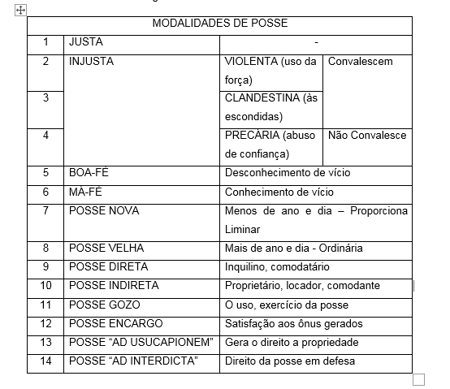
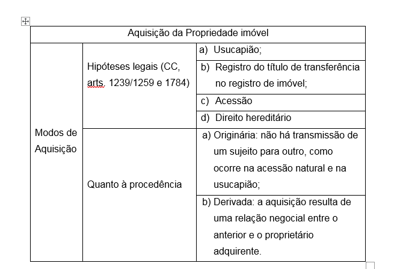
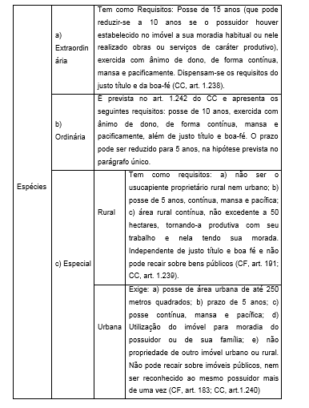
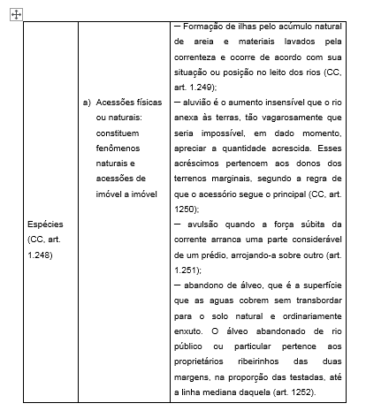
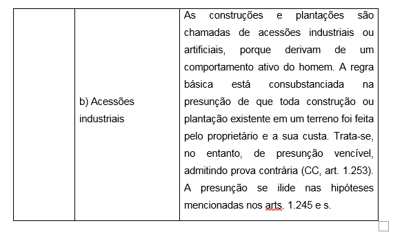

# As fundamentações do Direito Registral para Certificação de Imóveis Rurais

As fundamentações do Direito Registral para Certificação de Imóveis Rurais

1. REVISÃO DE LITERATURA
   1. **O Imóvel Rural e Atividade Registral Imobiliária**
   2.  **Antecedentes do Registro Imobiliário**

Como elementos que antecedem o registro de imóveis serão tratados, a seguir, a posse e a relação entre domínio e propriedade.

1. **Posse**

Ser possuidor de uma coisa é poder usar e gozar tirando proveito e colhendo frutos do que vamos chamar de uma fração ou porção de terra ou de um imóvel, já que estes são os objetos estudados. É você, mesmo sem dispor legalmente do terreno, poder zelar, cuidar, plantar, colher seus frutos; Embora você não possa transmiti-lo a outrem, vendê-lo, doá-lo ou gravá-lo, ou seja, não tem o domínio pleno da coisa, uma vez que esse título seria do proprietário desse imóvel, cujo nome está inscrito no cartório de Registro de Imóveis \(LIPORONI; BENITE, 2008\).

Através da Cessão de direitos hereditários, em ofício de notas \(tabelionato\), a posse pode ser transmitida. Foi criado, no sistema cartorário, uma maneira similar às transmissões de domínio. Com o propósito de dar legalidade nas transmissões, criaram-se as vendas e compras de posse \(LIPORONI; BENITE, 2008\).

A título oneroso ou gratuito, podendo até mencionar as dimensões, medidas perimetrais, indicação de origem e, semelhante aos títulos de dominiais, descrever a forma como obteve a posse, o tempo em que exerceu, bem como outros dados pertinentes, o detentor da posse de um determinado imóvel vende ou transmite a outrem os seus direitos através das escrituras de cessão de direitos possessórios \(LIPORONI; BENITE, 2008\).

Os direitos possessórios, quanto mais velhos forem, mais forças adquirem. Caso se torne objeto de ação judicial, a posse atual tem seu tempo somado à posse dos antecessores \(LIPORONI; BENITE, 2008\).

A posse poderá vir a transformar-se em domínio, através de uma ação de usucapião, ou servir de defesa contra o titular do domínio, quando invocado o direito num processo reivindicatório \(exceção de usucapião\), desde que a referida posse seja mansa e pacífica ao longo dos anos, com transmissões feitas por meio de documentação hábil, por qualquer Cartório de Notas ou Tabelionato \(LIPORONI; BENITE, 2008\).

A posse apresenta-se em diversas modalidades. As mesmas são mostradas na tabela a seguir:

Fonte: Liporoni e Benite, \(2008\).

**2.  Domínio e Propriedade**

Quando se tem o direito de propriedade de um imóvel, tem-se o domínio do mesmo, ou conforme o conceito: “direito de propriedade é o direito complexo, absoluto, perpétuo e exclusivo, pelo qual uma coisa fica submetida à vontade de uma pessoa, observadas as limitações da lei” \(LIPORONI; BENITE, 2008\).

No momento em que o instrumento de venda e compra é registrado perante o Oficial de Registro de Imóveis é que se concretiza a transmissão do domínio de um imóvel. Ao contrário da compra e venda de bens móveis, que se aperfeiçoa pela tradição, isto é, pela entrega da coisa móvel \(LIPORONI; BENITE, 2008\).

Uma questão a ser esclarecida é que domínio e propriedade não são sinônimos, como costuma ser confundido por manuais que abordam o assunto, nos quais, os dois termos ás vezes são colocados como se fossem o mesmo. Os dois institutos, no ordenamento jurídico, não se encontram em campos opostos, entretanto, mesmo que sejam complementares, é importante compreendê-los como distintos \(OLIVEIRA; BORDERES, 2009\).

Tratar propriedade como domínio, de maneira geral, é desconsiderar a constitucionalização pelo qual o direito brasileiro vem passando, em que a propriedade, muito mais que um direito exclusivo e ilimitado, deve cumprir suas funções sociais, cuja penalidade pode ser a perder da mesma \(OLIVEIRA; BORDERES, 2009\).

O domínio é a influência direta sobre a coisa, a relação do indivíduo com ela, dessa forma Aronne coloca o domínio como o centro dos direitos reais. Não há que se falar em terceiros ou obrigações, o campo dominial é apenas real. No domínio o sujeito é conjugado com o gozar, usar, dispor e reaver o bem e nada mais, está internamente, ligada ao poder \(OLIVEIRA; BORDERES, 2009\).

O proprietário tem a faculdade de usar, gozar, dispor e reaver o bem, desde que esteja estabelecido o seu domínio. No entanto, antes de exercer o que lhe é pertinente, deve atender a função social da propriedade, ou seja, deve atender as obrigações que a propriedade lhe impõe \(OLIVEIRA; BORDERES, 2009\).

* 1. **Formas de Aquisição de Propriedade Imóvel**

Segundo Gonçalves \(2010\), Os Modos de aquisição da Propriedade eram enumerados, taxativamente, no Código Civil de 1916, no art. 530, como: a\) registro de títulos de transferência de Registro de Imóvel; b\) acessão; c\) Usucapião; e d\) direito hereditário. O novo Código não especificou os elementos referidos anteriormente, limitou-se a tratar, no capitulo intitulado “Da aquisição da propriedade imóvel”, a usucapião, o registro do título e a acessão \(arts. 1238 a 1259\). Outro modo de aquisição da propriedade imóvel é o direito hereditário.

Com relação à procedência ou causa de aquisição, pode ser: Originária, quando não ocorre transmissão de um sujeito para outro, como, por exemplo, a acessão natural e a usucapião; e derivada, quando ocorre uma relação negocial entre o anterior proprietário e o adquirente, em que há uma transmissão de domínio devido à manifestação da vontade \(GONÇALVES, 2010\).

Fonte: Gonçalves, \(2010\).

Serão tratados, a seguir, referente às formas de aquisição da propriedade imóvel: a Usucapião, o Registro de títulos \(trará mais detalhes no item 1.6\), a acessão e o direito hereditário.

1.3**.1 Usucapião**

* * * 1. Conceito

A aquisição da propriedade pode ser gerada pela posse prolongada da coisa, desde que estejam presentes certas exigências estabelecidas em lei. Usucapião é a forma de aquisição da propriedade mediante a posse suficientemente prolongada em conformidade com determinados requisitos \(VENOSA, 2014\).

A usucapião tem como fundamento a aquisição da propriedade. O proprietário desidioso deve perder a coisa por não cuidar do seu patrimônio, em razão de alguém que, unindo posse e tempo, deseja firmar e pacificar a sua situação perante o bem e a sociedade \(FARIAS; ROSENVALD, 2011\).

* * * 1. Pressupostos

A usucapião tem como pressupostos: coisa hábil ou suscetível de usucapião, posse, decurso do tempo, justo título e boa-fé. O três primeiros são exigidos em todas as espécies de usucapião. Os dois últimos, justo título e boa-fé, são reclamados somente na usucapião ordinária. Inicialmente, é imprescindível verificar se o bem que será objeto de usucapião é suscetível de prescrição aquisitiva, uma vez que nem todos são sujeitos a ela, como os bens fora do comércio e os bens públicos \(GONÇALVES, 2010\).

Conforme Gonçalves \(2010\) são considerados fora do comércio os bens naturalmente indisponíveis \(não podem ser apropriados pelo homem, como o atmosférico, a agua do mar\), os legalmente indisponíveis \(bens de uso comum, de uso especial e de incapazes, os direitos da personalidade e os órgãos do corpo humano\) e os indisponíveis pela vontade humana \(colocados em testamentos ou doados, com clausula de inalienabilidade\).

 De acordo com Gonçalves \(2010\) os bens públicos não são objetos de usucapião. O art 2º do decreto n 22.785/33 diz que “os bens públicos, seja qual for sua natureza, não são sujeitos a prescrição”. O novo código civil designa: “Os bens públicos não estão sujeitos a usucapião” \(art. 102\).

Segundo Gonçalves \(2010\) para a configuração da prescrição aquisitiva é imprescindível a posse. Porém, não é qualquer tipo de posse que pode ser conduzida a usucapião. A lei diz que deve possuir certas características. A posse ad interdicta, justa, possui direito de proteção da posse, mas não é cabível para usucapião. Posse ad usucapionem é a que contém os requisitos determinados pelos arts. 1.238 a 1.942 do código civil, sendo o animo de dono o primeiro deles. Tais dispositivos fixam que o usucapiente deve possuir o imóvel “como seu”. O locatário, o comodatário e todos aqueles que exercem posse direta sobre a coisa, que sabem que não lhe pertence e com reconhecimento de direito dominial de outrem, não possuem ânimo de dono.

 Ser mansa e pacífica, ou seja, sem oposição, é o segundo requisito da posse ad usucapionem. Caso o possuidor não seja aborrecido pelo proprietário, durante todo o tempo fixado por lei, diz-se que sua posse é mansa e pacífica. Entretanto, se ele tomou alguma providencia na área judicial, com o intuito de quebrar a continuidade da posse, fica descaracterizada a ad usucapionem \(GONÇALVES, 2010\).

O terceiro requisito é que a posse seja contínua, ou seja, sem interrupção. A coisa não pose ser possuída em intervalos. É imprescindível que a tenha conservado durante todo o tempo até que se seja ingressado a ação de usucapião. Na eventualidade de ter se mudado para outro local, mas continuou comportando-se como dono em relação a coisa, não significa, necessariamente, abandono da posse \(GONÇALVES, 2010\).

O código civil admite, no art. 1243, mesmo exigindo a continuidade da posse, que o possuidor acrescente á sua posse a dos seus antecessores, para o fim de contar o tempo exigido para a usucapião, desde que todas sejam contínuas, pacíficas e, nos casos do art. 1.242, possuindo justo título e boa-fé \(GONÇALVES, 2010\).

Com relação ao decurso do tempo, os anos são contados por dias, e não por horas. O prazo é iniciado no dia seguinte ao da posse. O primeiro dia não se conta, por ser incompleto, mas conta-se o último. Na usucapião extraordinária, o prazo exigido é de 15 anos \(art. 1238\), que será reduzida a dez anos \(parágrafo único\) caso o possuidor tenha estabelecido no imóvel a sua moradia habitual, ou nele realizado obras ou serviços de caráter produtivo. No caso da ordinária, devendo o possuidor ter justo título e boa-fé, basta o prazo de dez anos \(art. 1.242\). Caso o imóvel tenha sido adquirido, onerosamente, com base em transcrição constante no registro próprio, cancelada posteriormente, desde que os possuidores tiverem estabelecido nele a sua moradia, ou realizado investimentos de interesse social e econômico \(parágrafo único\), o prazo será de cinco anos \(GONÇALVES, 2010\).

Outro aspecto a ser tratado é o justo título, que é o instrumento que faz um possuidor acreditar que é proprietário. Apesar de possuir algum defeito que possa impedir a sua aquisição, em tese, trata-se de um título formalmente idôneo a transferir a propriedade \(FARIAS; ROSENVALD, 2011\).

Tem-se ainda, sobre pressupostos, a Boa fé, que é o estado subjetivo da ignorância do possuidor quanto ao problema ou obstáculo que lhe impede de adquirir a coisa. Tem-se a convicção de que o bem possuído lhe pertence, fato determinante para fins de usucapião. Ao adquirir a coisa, erroneamente acreditou ser o proprietário \(FARIAS; ROSENVALD, 2011\).

* * * 1. Espécies

Segundo Gonçalves \(2010\), tanto bens móveis quanto bens imóveis podem ser objetos de usucapião. Para bens imóveis, o direito brasileiro apresenta três espécies de usucapião: A extraordinária, a ordinária e a especial, sendo esta última dividida em rural e urbana.

A tabela 3, a seguir, expõe essas modalidades e suas características.

Fonte: Gonçalves, \(2010\).

* * 1. Aquisição por Registro de Títulos

A aquisição da propriedade imóvel pelo registro do título, elencadas no arts. 1245, 1246 e 1247, é a transferência entre vivos da propriedade mediante o registro do título translativo no Registro de Imóveis competente \(DIREITONET, 2015\).

O alienante continua dono do imóvel enquanto não for registrar o título, que deve ser público \(DIREITONET, 2015\).

O registro é efetivado quando o título é apresentado ao oficial de registro e este prenotar no protocolo, que é a chave do registro geral \(DIREITONET, 2015\).

O item 1.6 trará mais detalhes referente ao assunto.

* * 1. Acessão

Quando o proprietário de um bem adquire à titularidade de tudo aquilo que a ele se adere, tem-se a acessão, que é um modo originário aquisitivo de propriedade. Por meio da acessão contínua, uma coisa é incorporada, ou mesmo unida, materialmente a outra, em estado permanente, por ação humana ou natural, e a propriedade da coisa acessória, que foi unida ou incorporada, é adquirida pelo proprietário da coisa principal \(FARIAS; ROSENVALD, 2011\).

A tabela 4 mostra as espécies de acessões.

Fonte: Gonçalves, \(2010\).

1.3.4 Direito Hereditário

A sucessão hereditária é determinada pela morte de um titular de um patrimônio. O fato da morte, fato jurídico, assinala o momento em que “o domínio e a posse da herança transmite-se desde logo aos herdeiros legítimos e testamentários” \(art. 1.572 do código de 1916\). O código atual expressa que “a herança transmite-se, desde logo, aos herdeiros legítimos e testamentários” \(art. 1784\). Neste caso, com a morte do autor da herança, a aludida herança guarda a noção de patrimônio que se transmite aos herdeiros \(VENOSA, 2014\).

Em função do princípio da continuidade do registro de imóveis será feito o inventário, a fim de que o herdeiro seja representado como titular do direito de propriedade. A aquisição desse direito ocorre com o falecimento do autor da herança, quando então, considera-se aberta à sucessão \(GONÇALVES, 2010\).

Pelo nosso direito, portanto, com a morte dá-se a abertura da sucessão, com a transmissão imediata, ipso iure, dos bens do morto aos herdeiros legítimos e testamentários. A relação de herdeiros legítimos é estabelecida em lei, segundo a ordem de vocação hereditária \(art. 1829\). Herdeiros testamentários são os aquinhoados em testamento com fração da universalidade que constitui a herança. Não se confundem com os legatários que recebem, por testamento, bem certo e individualizado do testador e necessitam pedir o bem legado; não o recebem tão logo ocorra a morte, como os herdeiros \(VENOSA, 2014, p. 230\).

Mantêm-se, como eram exercidas pelo morto, a mesma natureza e características da posse e propriedade recebidas pelos herdeiros \(VENOSA, 2014\).

* 1. **Princípios do Direito Registral**

Os princípios do direito registral são elementos que orientam o ato de registro, dando-lhe padrões jurídicos e características internas. As interpretações normativas são direcionadas por eles, e também atuam como norteadores para a formação legislativa \(FOLLE, 2010\).

O legislador, a fim de proporcionar maior segurança nos negócios imobiliários, criou um sistema de registro públicos, orientado por diversos princípios, que asseguram sua eficácia \(GONÇALVES, 2010\).

Serão tratados, a seguir, os princípios da publicidade, da Fé Pública, da Prioridade, da Especialidade, da Disponibilidade, da Continuidade, da Legalidade.

1.4.1 Princípio da publicidade

Conforme Folle \(2010\), O princípio da _**publicidade**_, dirigido a todos os registros públicos, considera que o registro torna público o conhecimento do ato registrado, logo, ninguém poderá alegar não conhecer o fato, visto que tenha sido registrado. No artigo 17 da Lei de Registros Públicos podem ser encontradas sua justificativa e incidência legal, a qual determina que qualquer pessoa poderá requerer a certidão do registro sem necessidade de informar o motivo do interesse, e o oficial de registro e seu preposto não podem se recusar a oferecê-la.

1.4.2 Princípio da Fé Pública

Segundo Folle \(2010\) o princípio da _**fé pública**_ é caracterizado pelo atributo da força probante do registro. O registro gera uma juris tantum favorável ao titular do registro, ou seja, presume-se relativa veracidade favorável a quem consta no registro, impondo a quem quiser contestar tal direito, a provar, em juízo, as suas alegações. O art. 252 da Lei nº 6.015/73 trata sobre o assunto.

* * 1. Princípio da Prioridade

O princípio da _**prioridade**_ protege quem primeiro registra o seu título. A prioridade do registro é assegurada pela prenotação. Caso mais de um título seja levado a registro no mesmo dia, aquele prenotado em primeiro lugar no protocolo é o que será registrado \(LRP, art. 191 e 192\). Se em trinta dias a parte interessada não atender as exigências formuladas pelo oficial, acabam os efeitos da prenotação, podendo ser examinado e registrado, caso esteja em ordem, o título que foi apresentado em segundo lugar. O prazo fica prorrogado até o julgamento do referido procedimento, caso o primeiro apresentante não se conforme com as exigências indicadas e requerer a suscitação da dúvida \(GONÇALVES, 2010\).

* * 1. Principio da especialidade

Segundo Folle \(2010\), o principio da especialidade, mostrado pelo artigo 176, § 1º, II e III da Lei nº 6.015/73, é um dos mais importantes e destacados princípios do direito registral. Este princípio determina que os atos de registro no registro de imóveis sejam especificados em relação ao objeto e aos sujeitos que possuam direitos em relação a ele. A especialização será objetiva, quando relacionada ao objeto e, subjetiva, quando relacionada às partes. Para a segurança jurídica que busca o registro imobiliário, esse principio é muito importante, dado que o objeto a ser registrado esteja perfeitamente individualizado, o que vai ao encontro do Georreferenciamento, que é uma das melhores formas de caracterizar, com precisão, o imóvel ao qual se refere o título.

Augusto \(2013\) observa três modalidades do principio da especialidade: especialidade do fato jurídico, a especialidade subjetiva e a especialidade objetiva. Vejamos o que ele diz referente a isso:

O princípio da **especialidade do fato jurídico** refere-se á boa técnica de inscrever o direito ou a informação juridicamente importante, relativa ao imóvel, mediante a completa especialização das relações jurídicas que tem ingresso no fólio real. Esse princípio deve ser observado tanto na elaboração do título, como também na escrituração do assento registral, que deve conter todos os elementos essenciais, naturais e acidentais do negócio jurídico. Assim, não haverá dúvida sobre qual direito foi constituído, sobre a abrangência desse direito e sobre eventuais condições, termos e encargos pactuados pelas partes \(AUGUSTO, 2013, p. 229\).

O princípio da **especialidade subjetiva** refere-se à completa e correta qualificação de todas as pessoas que ingressam no fólio real, quer na qualidade de titular do direito que está sendo registrado, quer de outras pessoas que possam ser afetadas por esse direito \(cônjuge, devedor solidário, interveniente-anuente etc.\) \(AUGUSTO, 2013, p. 229\).

O princípio da **especialidade objetiva** trata da delimitação espacial da propriedade, ou seja, da descrição técnica do imóvel e de outros elementos nele existentes, como servidão, reserva legal etc. A descrição do imóvel deve ser feita com base nas regras gerais de agrimensura, de forma que a descrição tabular, por si só, torne possível a materialização do desenho do imóvel \(AUGUSTO, 2013, p. 230\).

1.4.5 Princípio da Disponibilidade

Pelo princípio da _**disponibilidade**_ analisa-se se o imóvel está apto a ser alienado ou onerado. Trata-se de um princípio implícito, oriundo da regra de que a ninguém é permitido dispor de mais direitos do que possui. É necessário provar sua titularidade para poder alienar ou onerar o imóvel \(FOLLE, 2010\).

1.4.6 Princípio da Continuidade

Representado pelos artigos 195 e 237 da lei de registros públicos, o princípio da _**continuidade**_ exige que, entre os atos praticados na serventia imobiliária e seus objetos, haja uma sequencia lógica e ininterrupta. Para ser realizada a transmissão de um imóvel, deve existir uma perfeita sequencia entre antecessor e sucessor, bem como perfeita coincidência entre a descrição constante do registro e a constante do título \(FOLLE, 2010\).

Por esse principio, só é admitido o registro de um título, se o alienante for a mesma pessoa que figure no registro como o seu proprietário \(GONÇALVES, 2010\).

1.4.7 Princípio da Legalidade

De acordo com Folle \(2010\), No _**principio da legalidade**_, peculiar do contexto registral, tem-se o fato de que, por acordo entre as partes, não existe direito real, isto é, apenas é direito real o que se encontra qualificado em lei. Esse princípio somente permite o ingresso no registro de imóveis aqueles indicados em lei, logo, ele limita os títulos registráveis. Em torno da aplicação prática desse princípio existem dificuldades, pois o mesmo não pode ser tido como regra absoluta, mas como norteador, uma vez que é difícil para lei acompanhar as inovações e transformações do mundo jurídico e fático com a rapidez que elas acontecem. Os artigos 172 e 221 da Lei nº 6015/73 traz os dispositivos a ele relacionados.

1.4.8 A importância do princípio da especialidade objetiva para a Certificação de Imóveis Rurais;

No item 1.4.4, deste trabalho, abordou-se o princípio da especialidade objetiva, onde diz que o referido princípio trata da delimitação espacial da propriedade, isto é, da descrição técnica do imóvel e de outros elementos, e esta descrição é feita com base nas regras de agrimensura.

Referente à certificação, o decreto 4449/2002 em seu §1º do art. 9, expõe: “Caberá ao INCRA certificar que a poligonal objeto do memorial descritivo não se sobrepõe a nenhuma outra constante de seu cadastro georreferenciado e que o memorial atende às exigências técnicas, conforme ato normativo próprio”.

Tomando por base essas duas colocações, percebe-se o quanto os dois termos estão inter-relacionados. O princípio da especialidade objetiva é importante para a certificação por ser um elemento jurídico que impõe a descrição precisa do imóvel, uma correta delimitação da propriedade, utilizando técnicas de agrimensura, possibilitando que o mesmo seja precisamente individualizado. A certificação é a garantia da não sobreposição do imóvel a ser certificado com nenhum outro do cadastro georreferenciado, portanto advém da ideia do imóvel ser bem descrito, bem delimitado, distinguido dos demais.

1.4.9 Precisão posicional

A Lei de Registros Públicos \(Lei 6015/73\), no § 3º, do artigo 176, trata da precisão posicional, relatando que a mesma é fixada pelo INCRA. Vejamos o texto da Lei:

Art. 176...

§ 3o Nos casos de desmembramento, parcelamento ou remembramento de imóveis rurais, a identificação prevista na alínea a do item 3 do inciso II do § 1o será obtida a partir de memorial descritivo, assinado por profissional habilitado e com a devida Anotação de Responsabilidade Técnica – ART, contendo as coordenadas dos vértices definidores dos limites dos imóveis rurais, geo-referenciadas ao Sistema Geodésico Brasileiro e **com precisão posicional a ser fixada pelo INCRA**, garantida a isenção de custos financeiros aos proprietários de imóveis rurais cuja somatória da área não exceda a quatro módulos fiscais.

A NTGIR, 3ª edição, do INCRA, fala que informações posicionais são as coordenadas geodésicas \(φ,λ,h\) e suas respectivas precisões \(бx, бy, бh\). Com relação à precisão posicional absoluta, referem-se à precisão posicional vinculada ao sistema geodésico brasileiro \(SGB\), prevendo, então, a partir dos vértices do mesmo, a propagação de variância.

O item 4.3, da NTGIR, 3ª edição, aborda a Precisão das coordenadas, assim dispondo:

O valor da precisão posicional absoluta refere-se a resultante planimétrica \(horizontal\), conforme equação a seguir:

Onde:

* б p = precisão posicional \(m\);
* б ϕ = desvio padrão da latitude \(m\);
* б λ = desvio padrão da longitude \(m\).

Nota: No cálculo da precisão posicional desconsidera-se o valor do desvio padrão da altitude.

O item 4.4, da NTGIR, 3ª edição, tratar sobre os padrões de precisão, onde explana:

Os valores de precisão posicional a serem observados para vértices definidores de limites de imóveis são:

a\) Para vértices situados em limites artificiais: melhor ou igual a 0,50 m;

b\) Para vértices situados em limites naturais: melhor ou igual a 3,00 m; e

c\) Para vértices situados em limites inacessíveis: melhor ou igual a 7,50 m.

* 1. Cadastro Rural no Brasil

De acordo com Nascimento \(apud BARROS, 2011, p. 48\) a necessidade de implementação de um cadastro pode ser justificada através de três aspectos fundamentais: \(1\) facilita o cálculo e gestão dos tributos associado à propriedade imóvel, \(2\) proporciona segurança jurídica sobre o direito de propriedade e, \(3\) serve de apoio ao desenvolvimento e planejamento das zonas rurais e áreas urbanas.

A administração territorial brasileira é dividida entre os municípios \(cadastro urbano\) e a união \(cadastro rural e de terras públicas\), de maneira não compartilhada, confusa, possibilitando a existência de dois cadastros rurais nacionais, apresentando funções distintas \(tributária e fundiária\), independentes e administrados separadamente, conforme a finalidade de cada órgão gestor \(RFB e INCRA\). Pode-se falar também que existe o registro legal dos imóveis, que é um cadastro feito pelos cartórios do sistema de registro imobiliário, e o cadastro técnico ambiental que está sob a responsabilidade do Instituto Brasileiro de Meio Ambiente e dos Recursos Naturais Renováveis \(IBAMA\). Quando se trata do cadastro imobiliário urbano, a estrutura é definida de maneira autônoma por cada município do país \(NASCIMENTO apud BARROS, 2011, p. 48\).

Referente a cadastro rural, serão abordados, a seguir, o Sistema Nacional de cadastro Rural \(SNCR\), O Cadastro Fiscal de Imóveis Rurais \(CAFIR\) e o Cadastro Nacional de Imóveis Rurais \(CNIR\).

* * 1. SNCR

O sistema Nacional de Cadastro Rural foi criado pela [Lei 5.868, de 12 de dezembro de 1972](http://legislacao.planalto.gov.br/legisla/legislacao.nsf/Viw_Identificacao/lei%205.868-1972?OpenDocument) e regulamentado pelo decreto [72.106, de 18 de abril de 1973.](http://legislacao.planalto.gov.br/legisla/legislacao.nsf/Viw_Identificacao/DEC%2072.106-1973?OpenDocument)

A lei 5.868/72, em seu artigo 1º, expõe que o Sistema Nacional de Cadastro Rural possui cinco modalidades de cadastro, assim descritos:

I - Cadastro de Imóveis Rurais;

II - Cadastro de Proprietários e Detentores de Imóveis Rurais;

III - Cadastro de Arrendatários e Parceiros Rurais;

IV - Cadastro de Terras Públicas.

V - Cadastro Nacional de Florestas Públicas. [\(Incluído pela Lei nº 11.284, de 2006\)](http://www.planalto.gov.br/ccivil_03/_Ato2004-2006/2006/Lei/L11284.htm#art81).

O SNCR teve grandes mudanças ao longo de sua existência, que trouxeram prejuízos à manutenção dos dados, isto é, os registros de imóveis rurais existentes em arquivos gerados pelo sistema anterior a mudança não foram transferidos para a base de dados. Isso teve como consequência à perda de informações e de abrangência de um número maior de imóveis \(BARROS, 2011\).

A estrutura de coleta de dados do SNCR não foi alterada, no entanto está sendo preparada para atender os preceitos legais da lei 10267/2001, como a criação do cadastro nacional de imóveis rurais \(CNIR\), administrado pelo INCRA e RFB, o Georreferenciamento de imóveis rurais e a troca de informações entre o INCRA e os Serviços Registrais \(BARROS, 2011\).

Pode-se observar, na estrutura do novo SNCR, que o imóvel rural é relacionado a dados literais e gráficos, incluindo sua ligação com uma pessoa ou pessoas por detenção. A pessoa, que pode ser física ou jurídica, também está associada a um imóvel rural, ou imóvel, por detenção, por uso ou por ambos, estabelecendo, dessa forma, o cadastro de imóveis rurais e pessoas e seus relacionamentos \(BARROS, 2011\).

Segundo Geoeduc \(2015\) O INCRA, no início de abril, lançou o novo sistema nacional de cadastro rural, que trouxe como novidade a declaração de eletrônica para imóveis rurais cujo objetivo é modernizar a regularização fundiária no Brasil, para, adiante, fazer a integração com os dados sobre os imóveis declarados na receita federal que fazem parte do CNIR.

O SNCR busca dar mais comodidade aos proprietários de imóveis rurais para que atualizem seus dados e de seus imóveis, uma vez que permitirá o acesso pela internet, ou seja, através de qualquer computador com acesso a web, poderão ser realizadas as declarações de atualização cadastral \(GEOEDUC, 2015\).

Os formulários de papel serão extintos com essa atualização, entretanto o INCRA informa que o cadastro também continuará sendo realizado nas Unidades municipais de cadastro, Salas de cidadania, Unidades avançadas e Superintendências regionais da autarquia em todo o Brasil para os proprietários rurais que não dispõem de acesso à internet \(GEOEDUC, 2015\).

1.5.2 CAFIR

A RFB, em 1992, iniciou a cobrança do imposto sobre a propriedade territorial rural – ITR, onde usou a base de dados cadastrais do INCRA e quando se verificou a falta de informação e incompatibilidade dos dados. Com esses problemas houve a necessidade da RFB construir seu próprio cadastro de imóveis rurais \(PAIXÂO apud BARROS, 2011, p. 54\), o cadastro fiscal de imóveis rurais – CAFIR. A instrução normativa SRF 272, de 30 de dezembro de 2002, formalmente, criou o CAFIR, e o mesmo foi posteriormente implementado pela instrução normativa SRF 351, de 5 de agosto de 2003 \(RFB apud BARROS, 2011, p. 54\)

CAFIR é o cadastro conduzido pela Receita Federal do Brasil, com informações alusivas aos imóveis rurais do país, seus titulares e, se for necessário, os condôminos e compossuidores \(RFB, 2015\).

Subsidiar a arrecadação do imposto territorial rural \(ITR\) é função desse cadastro. De acordo com instrução normativa RFB nº 830, de 18 de março de 2008, “todos os imóveis rurais devem ser inscritos no CAFIR, inclusive os que gozam de imunidade e isenção do imposto sobre a Propriedade Territorial Rural \(ITR\)” \(BARROS, 2011\).

Conforme \(RFB, 2015\) No ato da inscrição no CAFIR é atribuído ao imóvel, para identificação junto à Receita Federal do Brasil, o NIRF \(Numero do Imóvel na Receita Federal\).

A DITR é a Declaração do Imposto sobre a Propriedade Territorial Rural, que toda pessoa física ou jurídica deve entregar anualmente, desde que seja proprietária \(enfiteuta ou foreira\), ou possuidora a qualquer título, inclusive a usufrutuária, de imóvel rural \(RFB apud BARROS, 2011, p.54\).

Através do documento de informação e atualização cadastral do ITR \(DIAC\) realiza-se a coleta de informações, e refere-se a dados do imóvel rural e do titular \(preenchido por todas as pessoas físicas ou jurídicas obrigadas a entregar a DITR\), e pelo documento de informação e apuração do ITR \(DIAT\), destinado a apuração do ITR referente ao imóvel rural, sujeito ao cálculo do imposto. Quando o imóvel é imune ou isento o DIAT não é disponibilizado \(RFB apud BARROS, 2011, p.55\).

Convém salientar que o SNCR e o CAFIR referem-se a conceitos distintos de imóvel rural. O SNCR considera o imóvel rural pela destinação ou uso destinado a atividades de cunho rural \(como agricultura e pecuária\). Já o CAFIR considera os imóveis pela localização, logo, somente aqueles fora do perímetro urbanos são cadastrados. Deve-se considerar essa diferença quando for implementar o CNIR \(será tratado no item seguinte\), que é uma base única de informações sobre imóveis rurais \(BARROS, 2011\).

* * 1. CNIR

A lei 10.267 de 2001 criou o Cadastro Nacional de Imóveis Rurais \(CNIR\), onde expõe em seu artigo 2º: “Fica criado o Cadastro Nacional de Imóveis Rurais - CNIR, que terá base comum de informações, gerenciada conjuntamente pelo INCRA e pela Secretaria da Receita Federal, produzida e compartilhada pelas diversas instituições públicas federais e estaduais produtoras e usuárias de informações sobre o meio rural brasileiro”.

O CNIR ainda não teve, efetivamente, a sua implementação. Foi criado, em 2008, um grupo de trabalho cujo objetivo era estabelecer as bases para essa implementação, em que participaram técnicos do INCRA, Receita Federal e SEPRO, envolvidos com o Sistema Nacional de Cadastro Rural \(SNCR\) e o cadastro fiscal de Imóveis rurais \(CAFIR\). Um Projeto de Reforma Cadastral e de Estruturação do Cadastro Nacional de Imóveis Rurais foi elaborado com a finalidade de propor a concepção e construção do Cadastro Nacional de Imóveis Rurais \(CNIR\). O produto final do projeto em questão é o cadastro rural, que compreende o conjunto de dados sobre imóveis rurais a serem compartilhados com outras instituições \(BARROS, 2011\).

O conteúdo do CNIR consiste dos elementos que devem constituir a base comum de informações referente aos imóveis rurais, que será compartilhada por meio do banco de dados cadastrais. Em razão de ser um cadastro único, esse conteúdo deverá ser estabelecido com base no levantamento das necessidades das instituições produtoras e usuárias das informações, a fim de que a implantação do novo sistema beneficie a todos e não gere situações em que determinados órgãos tenham que manter suas próprias bases de informações, independentemente do CNIR \(ISHIKAWA, 2007\).

A ausência de duplicidade de informações é a grande vantagem de um cadastro único. Essa duplicidade provoca, sobre o mesmo imóvel, a existência de dados conflitantes. O CNIR deverá atender ao conceito de Cadastro Multifinalitário, em que cada usuário superpõe o seu cadastro específico sobre uma base comum de informações. A criação de um cadastro de informações geométricas e legais atualizadas é uma das mais importantes vantagens do CNIR \(ISHIKAWA, 2007\).

* 1. **Registro de Imóveis**

Segundo Augusto \(2013\), no Brasil, o registro de imóveis é um serviço público, realizado de maneira privada, sendo delegado pelo poder público, com a atribuição de assegurar a publicidade, autenticidade, segurança e eficácia dos direitos reais e de alguns direitos pessoais que incidem na propriedade imobiliária.

Conforme Augusto \(2013\), o oficial de registro de imóveis, que é um profissional do direito, dotado de fé pública, provido através de concurso público de provas e títulos, exerce a função registral. No uso de suas atribuições, o registrador utiliza da qualificação registral, que consiste numa decisão juridicamente fundamentada sobre a viabilidade ou não da entrada de um determinado título nos livros registrais. Levando-se em conta que grande parte dos direitos reais apenas é concretizada com o registro, Compete ao registrador de imóveis decidir pela constituição, modificação ou extinção de direitos reais que incidem sobre o imóvel.

Segundo Gonçalves \(2010\), Para a transferência ou aquisição do domínio, no direito brasileiro, não basta o contrato. Por meio dele, criam-se somente obrigações e direitos, conforme estabelece o art. 481 do Código Civil. O domínio transfere-se somente pela tradição, se for coisa móvel \(art. 1267\) e através do registro translativo, se for imóvel \(art. 1245\).

A seguir serão abordados aspectos concernentes ao registro de títulos. Serão discorridos: Matrícula, Registro, Averbação, Livros obrigatórios e Retificação de registro.

**1.6.1. Matrícula**

Conforme Gonçalves \(2010\), Pretendendo melhor individualizar os imóveis, a atual Lei dos Registros Públicos criou a matrícula, exigindo que seja realizada antes do registro, quando o imóvel sofrer a primeira alteração na titularidade após a sua vigência \(arts. 176,§ 1º, e 228\). Antes da aludida Lei os imóveis recebiam, a cada alienação, um novo numero de transcrição. Depois que a lei entrou em vigor, o antigo número de transcrição só são conservados nos imóveis que não sofreram nenhuma alteração em sua titularidade. Os imóveis que foram vendidos, doados, permutados ou transferidos por sucessão hereditária receberam um novo numero de matricula, em razão do registro do título translativo \(escritura pública, formal de partilha\), em que este número sempre os acompanhará. Na mesma matricula serão registradas as alienações posteriores. Esta só é feita por ocasião do primeiro registro, depois que entrou em vigor a atual lei de registros públicos, e o antecede. O registro é que gera a transferência de propriedade, não a matrícula. Quando parte de um imóvel for alienada \(desmembrada\), formará ela um novo imóvel, que deverá ser matriculado e receber numero próprio. Outra situação a ser abordada é a de ser possível solicitar a fusão de dois ou mais imóveis contíguos, que pertencem ao mesmo proprietário, em uma só matrícula, de novo número, encerrando-se as primitivas \(art. 234\).

**1.6.2 Registro**

Segundo Farias e Rosenvald \(2011\), trata-se de mais uma criação da atual LRP \(art. 168\) e adotada pelo Código Civil \(art. 1245\), que substitui os termos transcrição e inscrição, utilizadas na ordem civil revogada. É o ato que acontece posteriormente á matrícula. Fundamenta-se através de todo e qualquer ato jurídico de disposição total ou parcial da propriedade, além de atos característicos de direitos reais sobre a coisa alheia \(v.g hipoteca, usufruto\) ou ônus e limitações a ele equiparados \(v.g penhora, bem de família\).

O registro é o ato que concretiza a transferência de propriedade, e sucede à matrícula. Mantém-se o numero inicial da matrícula, porém numerações diferentes serão dadas aos subsequentes registros, em ordem cronológica, vinculados ao número da matricula-base \(GONÇALVES, 2010\).

**1.6.3 Averbação**

Qualquer anotação feita à margem de um registro, para indicar alterações ocorridas no imóvel, caracteriza-se como averbação. Tais alterações, tanto podem ser em relação à situação física \(edificação de uma casa, mudança de nome da rua\), quanto em relação à situação jurídica do proprietário \(mudança de solteiro para casado, entre outros\). São averbados fatos posteriores a matricula e ao registro, de forma que a essência desses atos não seja alterada, modificando somente características do imóvel ou do sujeito \(GONÇALVES, 2010\).

Conforme Farias e Rosenvald \(2011\), a efetivação de futuros registros sobre o imóvel apresentará dificuldades, caso haja omissão do titular em realizar averbações, uma vez que não haverá uma perfeita coincidência entre a documentação mostrada pelos interessados e a realidade que constará do ofício imobiliário. Deste modo, compatibilizar a verdade dos fatos com a verdade cartorária é a real função da averbação.

1.6.4 **Livros Obrigatórios**

Gonçalves, em relação aos livros obrigatórios, expõe:

São em número de cinco \(LRP, art. 173\). O livro n.1 ─ Protocolo ─ serve para anotação de todos os títulos apresentados diariamente. É chamado de “a chave do registro de imóveis” ou a porta de entrada, pela qual devem passar todos os títulos registráveis. A data do registro, para efeitos legais, é a da prenotação do título no protocolo, ainda que efetuado posteriormente \(CC, art. 1.246\). O livro n.2 ─ Registro Geral ─ é destinado à matrícula e ao registro de títulos, além de outros atos. É nesse livro que se pratica o ato que se transfere o domínio dos imóveis \(registro, anteriormente chamado de transcrição\). O livro n.3 ─ Registro Auxiliar ─ destina-se ao registro de atos que devem, por lei, ser registrados, embora não se destinem à transferência do domínio, como as convenções antenupciais, as convenções de condomínio, as cédulas de crédito rural etc. \(art. 178\). Os livros n. 4 e n. 5 funcionam como uma espécie de índices. O n. 4 ─ Indicador Real ─ é o repositório de todos os imóveis que figurarem nos demais livros, podendo ser localizados por seus dados e características. O livro n. 5 ─ Indicador Pessoal ─ contém o nome de todas as pessoas que figuram no registro como proprietárias, em ordem alfabética, facilitando a expedição de certidões \(GONÇALVES, 2010, p.133\).

1.6.5 **Retificação de Registro**

Segundo Gonçalves \(2010\), quando há inexatidão nos lançamentos, ou seja, “se o teor do registro de imóveis não exprimir a verdade” \(CC, art. 1.247; LRP, art. 212\), é admissível à retificação do registro.

Conforme Gonçalves \(2010\), um dos elementos distintivos dos sistemas brasileiro e alemão é a retificabilidade, que consta nos arts, 212 e 213 da Lei de Registros públicos. Os citados dispositivos, em sua redação original, permitiam a realização da retificação apenas perante o juiz corregedor do registro imobiliário. Entretanto, a lei 10.931, colocou-lhe nova redação, em que permite que o pedido de retificação seja feito ao próprio oficial de registro competente, nos casos em que o registro ou averbação forem omissos, imprecisos, ou não exprimirem a verdade, mas também permitindo ao interessado “requerer a retificação por meio de procedimento judicial”. O citado art. 212 refere-se apenas a “requerimento do interessado”, já o art. 213 trata também sobre o ato de ofício, nas hipóteses descritas nas hipóteses _a_ a _g_ do inciso I.

Foi adotado, assim, um sistema misto, ou seja, administrativo, com alguma forma de contenciosidade: na retificação de área, para aumenta-la ou diminuí-la, ou na alteração de divisas, alienantes e confrontantes são citados e, da decisão proferida, cabe apelação \(GONÇALVES, 2010, p.134\)

1.7 Lei 10267/2001

1.8 Georreferenciamento de Imóvel Rural e certificação \(falar também dos prazos\)

1. ANÁLISES DOS NOVOS PARADIGMAS DA CERTIFICAÇÃO

2.1 Qualificação Profissional

1. ART: Anotação de Responsabilidade Técnica

2.2 Sistema de Referência \(Falar que a partir de fevereiro de 2015 tudo é sirgas 2000\)

2.3 Problemas encontrados da interconexão entre Cadastro e Registro.

2.3 Processo de certificação antes e depois do Sigef.

CONCLUSÕES

REFERÊNCIAS BIBLIOGRÁFICAS

REFERÊNCIAS

LIPORONI, Antônio Sérgio; BENITE, Odair Martins. **Posse e Domínio**. 2. Ed. São Paulo: LEUD, 2008.

OLIVEIRA, Álvaro Barros de; BORDERES, Kenia Bernardes. Propriedade, Domínio, Titularidade, Posse e Detenção**. Revista Jurídica - CCJ/FURB**. v. 13, nº 25, p. 99 - 107, jan./jul. 2009.

GONÇALVES, Carlos Roberto; **Direito das Coisas**. 11. Ed. São Paulo: Saraiva, 2010.

FARIAS, Cristiano Chaves de; ROSENVALD, Nelson. **Direitos reais**. 7. Ed. Rio de Janeiro: Lumen Juris, 2011.

VENOSA, Silvio de Salvo. **Direito Civil: direitos reais**. 14. Ed. São Paulo: Atlas, 2014.

AUGUSTO, E. A. A. **Registro de imóveis, Retificação de Registro e Georreferenciamento: Fundamento e Prática.** 1. ed. São Paulo: Saraiva, 2013.

Folle, Francis Perondi. **Georreferenciamento de Imóvel Rural: Doutrina e Prática no Registro de Imóveis**. São Paulo: Quartier Latin, 2010.

DIREITONET. **Formas da aquisição da propriedade imóvel**. Disponível em: &lt;http://www.direitonet.com.br/artigos/exibir/1361/Formas-de-aquisicao-da-propriedade-imovel&gt; Acesso em: 09 Ago. 2015.

BRASIL. Lei nº 6.015, de 31 de Dezembro de 1973. Disponível em: &lt;http://www.planalto.gov.br&gt; Acesso em: 16/08/2015.

INCRA. Norma Técnica para o Georreferenciamento de Imóveis Rurais \(NTGIR\). 3ª ed. Brasília, 2013.

BARROS, E. R. O. **Uma proposta para o controle de Qualidade do processo de certificação de imóveis rurais**. Recife: UFPE, 2011. Dissertação \(Mestrado em Ciências Geodésicas e Tecnologias da Geoinformação\), Centro de Tecnologia e Geociências, Universidade Federal de Pernambuco, 2011.

BRASIL. Lei nº 5.868, de 12 de Dezembro de 1972. Disponível em: &lt;http://www.planalto.gov.br&gt; Acesso em: 22/08/2015.

## GEOEDUC. INCRA lança novo sistema para cadastro de imóveis rurais. Entenda o que muda. Disponível em: &lt;http://www.geoeduc.com/incra-lanca-novo-sistema-para-cadastro-de-imoveis-rurais-entenda-o-que-muda/&gt; Acesso em: 22/08/2015.

## RFB. Receita Federal do Brasil. CAFIR – Cadastro de Imóveis Rurais. Disponível em: &lt;http://www.receita.fazenda.gov.br/TextConcat/Default.asp?Pos=1&Div=Pessoajuridica/cafir/InfoGerais&gt; Acesso em: 22/08/2015.

ISHIKAWA, Mauro Issamu. **Georreferenciamento em Imóveis Rurais**: Métodos de Levantamentos na Aplicação da Lei 10.267/2001. Botucatu: UNESP, 2007. Tese \(Doutorado\), Faculdade de Ciências Agronômicas, Universidade Estadual Paulista Júlio de Mesquita Filho, 2007.

BRASIL. [Lei no 10.267, de 28 de agosto de 2001.](http://legislacao.planalto.gov.br/legisla/legislacao.nsf/Viw_Identificacao/lei%2010.267-2001?OpenDocument) Disponível em: &lt;http://www.planalto.gov.br&gt; Acesso em: 25/08/2015.

BRASIL. [Decreto nº 4.449, de 30 de outubro de 2002.](http://legislacao.planalto.gov.br/legisla/legislacao.nsf/Viw_Identificacao/DEC%204.449-2002?OpenDocument) Disponível em: &lt;http://www.planalto.gov.br&gt; Acesso em: 31/08/2015.

